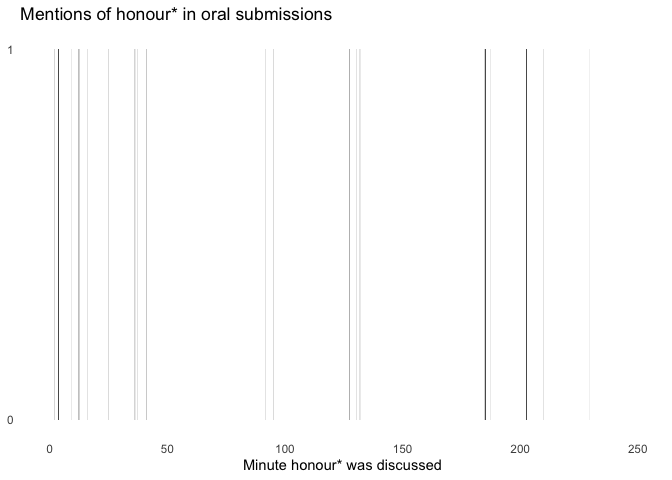

# text processing example
David Hood

This is an example of taking the day 1 unofficial machine generated
transcription of Te Triti oral submissions provided by Dr Sanjana
Hattotuwa at
https://bsky.app/profile/sanjanah.bsky.social/post/3lgqdi63a6k22 and
applying some text processing to it using R, as an example of such
processing.

The machine transcript has been downloaded to the working directory

``` r
library(officer) # automatically accessing word doc contents
library(stringr) # easy text handling
library(dplyr) # structuring general data handling
library(tidyr) # rearranging document structure
library(ggplot2) # an example graph
```

To speed up subsequent runs of the file, I am saving the data from of
the document contents as that is the major bottleneck

``` r
if(!file.exists("day1.csv")){
  day1_file <- read_docx("Justice Committee - Time Coded.docx")
  day1_content <- docx_summary(day1_file)
  write.csv(day1_content, file="day1.csv", row.names = FALSE)
}

day1 <- read.csv("day1.csv")
```

Timestamp text is paragraphs of the fomat numbers and :, then a hyphen,
then more numbers and :. The text in the paragraph after a timestamp is
associated with that time period.

``` r
day1v2 <- day1 |> 
  mutate(isTime = str_detect(text, pattern = "[1234567890:]+-[1234567890:]+")) 
day1v2$isContent <- FALSE
day1v2$isContent[which(day1v2$isTime)+1] <- TRUE
day1v2 <- day1v2[day1v2$isTime | day1v2$isContent,]
day1v3 <- day1v2 |> 
  mutate(said = lead(text)) |> 
  filter(isTime) |> 
  separate(text, into=c("stamp1","stamp2"),sep = "-") |> 
  separate(stamp1, into=c("hour1","minute1", "second1"), sep=":",fill = "left",
           convert=TRUE) |> 
  separate(stamp2, into=c("hour2","minute2", "second2"), sep=":",fill = "left",
           convert=TRUE) |>
  mutate(hour1 = ifelse(is.na(hour1), 0, hour1),
         hour2 = ifelse(is.na(hour2), 0, hour2),
         minute_start = hour1*60 + minute1 + second1/60,
         minute_end = hour2*60 + minute2 + second2/60) |> 
  select(original_paragraph = doc_index, minute_start, minute_end,said)
```

As an example, how much did people, per unit time, use the word (or part
of word) “honour”

``` r
honour_etc <- day1v3 |> 
  mutate(stemcount = str_count(tolower(said), "honour"))
ggplot(honour_etc, aes(ymax=stemcount, xmin=minute_start, xmax=minute_end)) +
  geom_rect(ymin=0) + theme_minimal() +
  labs(title="Mentions of honour* in oral submissions",
       x="Minute honour* was discussed") +
  theme(panel.grid = element_blank()) +
  scale_y_continuous(breaks=c(0,1))
```



For additional files from additional sessions, it is basically the same
process of putting the downloaded docx file in the working directory
(normaly the same folder as the script) and customising the name of the
file being read in to match, and the name of the variable being stored
under. So, for example the read the data in block early on in the above
might (for day 2 morning) become

``` r
if(!file.exists("day2.csv")){
  day1_file <- read_docx("Justice Committee - Time Coded - Morning session.docx")
  day1_content <- docx_summary(day1_file)
  write.csv(day1_content, file="day2.csv", row.names = FALSE)
}

day2 <- read.csv("day2.csv")
```

Of course, once you start adding multiple sessions you might want to add
a variable for which session they are from, if working with more than
one.

``` r
#using .1 as a code for morning only, .2 for afternoon, and .3 for full day, you might add the codes
day1$session <- 1.3
day2$session <- 2.1
```

Since having a session variable means that the data can be combined into
a singly data set.
